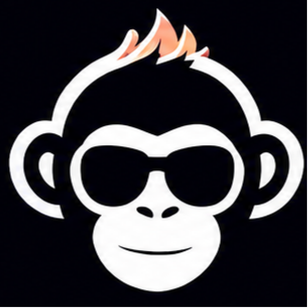
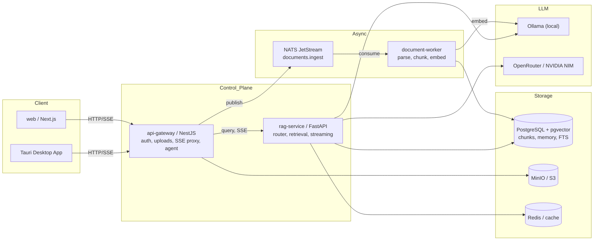
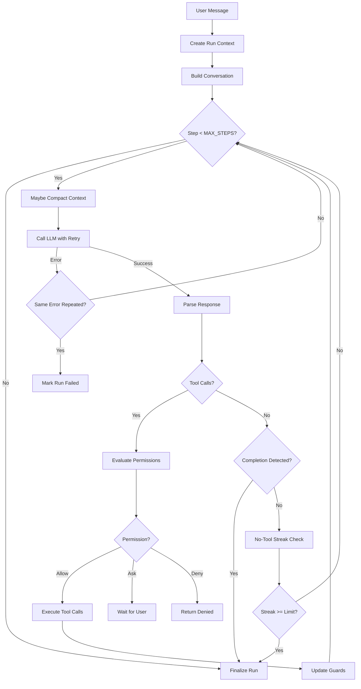
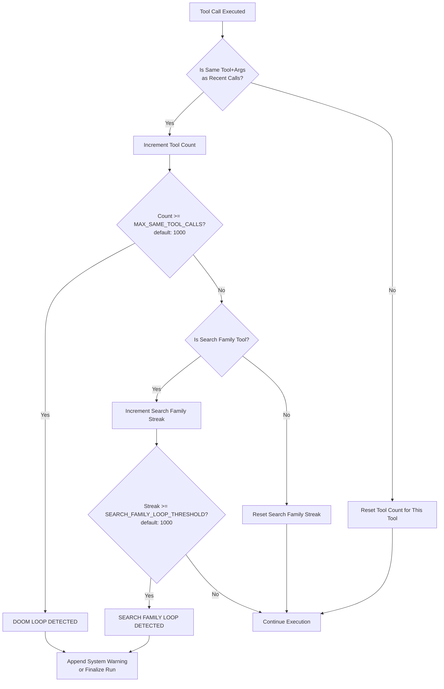
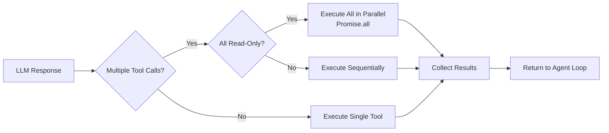
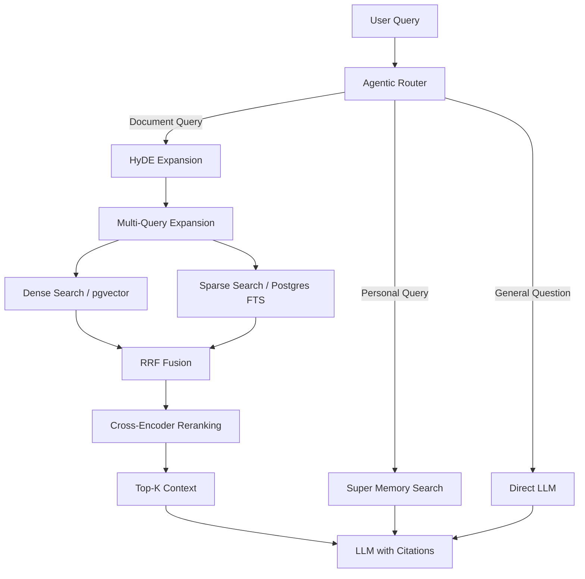

<div align="center">

# Smoke Monkey Desktop

### Chat LLM with **super memory** & **dynamic visual** widgets

A production-grade AI chat platform that remembers every conversation across
sessions, routes each question through the smartest retrieval path, and renders
**live animated diagrams** right inside the chat — all with page-level
citations.

**Built-in agent API harness** — the runtime behind an autonomous coding agent,
comparable to OpenAI Codex, Google Antigravity, and Claude Code's cloud harness.
Drive any model over REST/SSE or WebSocket: file editing, testing, git, Docker,
SSH, MCP, permission gates, and checkpoint/resume. See
[Agent API Harness](docs/agent-api-harness.md).

[](https://github.com/RajdeepDevelopment/smoke-monkey-desktop)
[](LICENSE)
[](CONTRIBUTING.md)

<p align="center">
  
</p>

---


</div>

---

## Features

| Capability | What it does |
|---|---|
| **Agent harness API** | Drive an autonomous coding agent over **REST + SSE / WebSocket**: 29 built-in tools, per-tool permission gates, checkpoint/resume, sub-agents, and 8 model providers (OpenAI, OpenRouter, NVIDIA NIM, Gemini, xAI, OpenCode Zen, OmniRoute free, Ollama). |
| **Super memory** | Every exchange is embedded into a vector store and durable user facts (preferences, projects) are extracted into a long-term profile. |
| **Dynamic visual** | The LLM can drop **animated canvas widgets** into the answer stream — flowcharts, sorting demos, algorithm walkthroughs. |
| **Document RAG** | Upload PDFs; ask natural-language questions; get streamed answers with page-level citations. |
| **Agentic query router** | An LLM router decides per message between knowledge base, conversation memory, live web, or plain chat. |
| **Hybrid retrieval** | Dense (pgvector) + sparse (Postgres FTS) fused with RRF, refined with cross-encoder reranking, HyDE and multi-query expansion. |
| **User-owned keys** | Users can plug in their own OpenRouter/NVIDIA keys — encrypted at rest (AES-256-GCM) and cached in Redis. |
| **Agent tools** | The agent can list files, search code, read/write files, run commands, and manage git — with loop guards to prevent infinite tool cycling. |

## Tech Stack

| Layer | Technologies |
|---|---|
| Frontend | Next.js, React, Tailwind CSS, Tauri (desktop) |
| Transports | REST, Server-Sent Events (SSE), WebSocket (`/ws/agent`) |
| Backend | NestJS (API gateway), FastAPI (RAG service), Python, Node.js |
| Data & AI | PostgreSQL, pgvector, Redis, Ollama, OpenRouter, NVIDIA NIM |
| Messaging | NATS JetStream, MinIO (S3) |
| Infra | Docker, Kubernetes, Terraform |

## Architecture

### System Overview



### Agent Loop Architecture



### Doom Loop Guard System



### Parallel Tool Execution



### Hybrid Retrieval Flow



## Install on macOS

Build the desktop app from source and install it to `/Applications` in one
command (requires `node`, `pnpm`, and Xcode Command Line Tools):

```bash
./install.sh
```

What it does:
- installs workspace deps (`pnpm install`) and shuts down any running instance
- rebuilds the api-gateway + web UI, then the Rust release binary
- assembles `Smoke Monkey.app` and copies it to `/Applications`

Start it with `open "/Applications/Smoke Monkey Desktop.app"`. OmniRoute is not
bundled — the app self-installs it on first launch and shows
**"Initializing OmniRoute…"** while doing so. See also
[`bundle-app.sh`](apps/desktop/scripts/bundle-app.sh) for the hand-rolled
`.app` assembler.

## Quick Start

Requires Docker + Docker Compose (~8 GB free disk for local models).

```bash
cp .env.example .env        # configure providers (or use local Ollama)
make up                     # build & start the full stack
docker compose logs -f ollama   # wait for model pulls (first run)
make seed-user              # demo account: demo@rag.local
make web                    # open http://localhost:3001
```

Then: sign in > **Knowledge Base** > upload a PDF > wait for `ready` >
**Chat** > ask away. Answers stream in with sources.

### Ports

| Service | URL |
|---|---|
| Web app | http://localhost:3001 |
| API gateway | http://localhost:3000 |
| rag-service | http://localhost:8000 |
| Ollama | http://localhost:11434 |
| MinIO console | http://localhost:9001 |
| NATS monitor | http://localhost:8222 |
| Postgres | localhost:5432 |

## Desktop Mode (SQLite)

For local development without Docker, the API gateway runs in SQLite mode:

```bash
cd apps/api-gateway
DB_DRIVER=sqlite node dist/main.js
# Runs on http://localhost:8642
```

Key differences from Docker mode:
- No Redis, NATS, or MinIO (skipped automatically)
- SQLite database at `~/.smokemonkey/smokemonkey.db`
- Ollama runs locally at `http://localhost:11434`

## Project Structure

```
smoke-monkey-desktop/
├── apps/
│   ├── api-gateway/        NestJS — auth, uploads, chat SSE, agent, health
│   ├── rag-service/        FastAPI — query pipeline, retrieval, streaming
│   ├── document-worker/    async PDF ingestion (parse → chunk → embed → index)
│   ├── desktop/            Tauri desktop app wrapper
│   └── web/                Next.js — chat + documents + canvas renderer
├── packages/               shared TS contracts / config
├── infrastructure/         docker, k8s, helm, terraform
├── docs/                   architecture + algorithm docs (mermaid)
└── testingAgent/           agent testing utilities
```

## Configuration

| Variable | Default | Purpose |
|---|---|---|
| `LLM_PROVIDER` | `openrouter` | `ollama` / `openrouter` / `nvidia` / `gemini` |
| `ROUTER_ENABLED` | `true` | agentic query router |
| `MEMORY_ENABLED` | `true` | conversation memory embeddings + fact extraction |
| `MEMORY_TOP_K` | `5` | memory hits injected into the answer prompt |
| `WEB_SEARCH_ENABLED` | `false` | live web context (DuckDuckGo, no key) |
| `JWT_SECRET` | `change-me-in-production` | **set a real secret** |
| `DB_DRIVER` | `sqlite` | `sqlite` (desktop) or `postgres` (Docker) |

See [`.env.example`](.env.example) for the full list. **Never commit your `.env`.**

## Contributing

Contributions of all kinds are welcome. See [CONTRIBUTING.md](CONTRIBUTING.md)
for the workflow, code standards, and the secret-handling policy.

## License

**Non-commercial.** This project is licensed under the
[PolyForm Noncommercial License 1.0.0](LICENSE) — you may use, modify, and
distribute it for noncommercial purposes (research, education, personal
projects, nonprofits). Commercial use requires a separate license.
