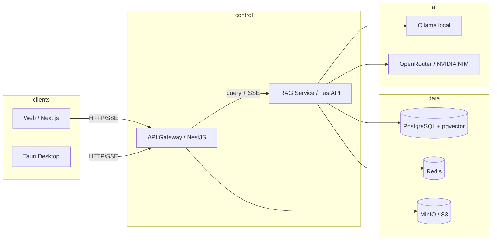

<div align="center">

# Smoke Monkey Desktop

### Agentic AI harness — chat with super memory and live visual widgets

A production-grade agent platform: an autonomous coding agent (29 tools, 8 model
providers, permission gates, checkpoint/resume) plus conversation memory and
document RAG with streamed, cited answers. Comparable to OpenAI Codex, Google
Antigravity, and Claude Code's cloud harness. See
[Agent API Harness](docs/agent-api-harness.md).

[](https://github.com/RajdeepDevelopment/smoke-monkey-desktop)
[](LICENSE)
[](CONTRIBUTING.md)

<p align="center">
  
</p>

</div>

---


---

## Features

| Capability | What it does |
|---|---|
| **Agent harness API** | Autonomous coding agent over **REST + SSE / WebSocket**: 29 tools, permission gates, checkpoint/resume, sub-agents, 8 providers (OpenAI, OpenRouter, NVIDIA NIM, Gemini, xAI, OpenCode Zen, OmniRoute, Ollama). |
| **Super memory** | Every exchange is embedded into a vector store; durable user facts (preferences, projects) become a long-term profile. |
| **Dynamic visual** | The LLM can render **animated canvas widgets** in the answer stream — flowcharts, sorting demos, algorithm walkthroughs. |
| **Document RAG** | Upload PDFs, ask questions, get streamed answers with page-level citations. |
| **Hybrid retrieval** | Dense (pgvector) + sparse (Postgres FTS) fused with RRF, cross-encoder reranking, HyDE, multi-query expansion. |
| **Agentic query router** | Per-message routing between knowledge base, memory, live web, or direct chat. |
| **User-owned keys** | Plug in your own provider keys — encrypted at rest (AES-256-GCM), cached in Redis. |

## Architecture



## Install on macOS

Build from source and install to `/Applications` in one command (needs `node`,
`pnpm`, and Xcode Command Line Tools):

```bash
./install.sh
```

- installs workspace deps and shuts down any running instance
- rebuilds api-gateway + web UI, then the Rust release binary
- assembles `Smoke Monkey.app` and copies it to `/Applications`

Run it with `open "/Applications/Smoke Monkey Desktop.app"`. OmniRoute is not
bundled — the app self-installs it on first launch (look for
**"Initializing OmniRoute…"**). See
[`bundle-app.sh`](apps/desktop/scripts/bundle-app.sh).

## Quick Start

Requires Docker + Docker Compose (~8 GB free disk for local models):

```bash
cp .env.example .env        # configure providers (or use local Ollama)
make up                     # build & start the full stack
docker compose logs -f ollama   # wait for model pulls (first run)
make seed-user              # demo account: demo@rag.local
make web                    # open http://localhost:3001
```

Then: sign in > **Knowledge Base** > upload a PDF > wait for `ready` > **Chat**.
Answers stream in with sources.

### Ports

| Service | URL |
|---|---|
| Web app | http://localhost:3001 |
| API gateway | http://localhost:3000 |
| rag-service | http://localhost:8000 |
| Ollama | http://localhost:11434 |
| Postgres | localhost:5432 |

## Desktop Mode

Run the gateway standalone (SQLite, no Docker) for local development:

```bash
cd apps/api-gateway
DB_DRIVER=sqlite node dist/main.js    # http://localhost:8642
```

Skips Redis/NATS/MinIO automatically; SQLite lives at
`~/.smokemonkey/smokemonkey.db`; Ollama runs locally at `:11434`.

## Project Structure

```
smoke-monkey-desktop/
├── apps/
│   ├── api-gateway/        NestJS — auth, uploads, chat SSE, agent, health
│   ├── rag-service/        FastAPI — query pipeline, retrieval, streaming
│   ├── document-worker/    async PDF ingestion (parse → chunk → embed → index)
│   ├── desktop/            Tauri desktop app wrapper
│   └── web/                Next.js — chat + documents + canvas renderer
├── packages/               shared TS contracts / config
├── infrastructure/         docker, k8s, helm, terraform
└── docs/                   architecture + algorithm docs
```

## Configuration

| Variable | Default | Purpose |
|---|---|---|
| `LLM_PROVIDER` | `openrouter` | `ollama` / `openrouter` / `nvidia` / `gemini` |
| `ROUTER_ENABLED` | `true` | agentic query router |
| `MEMORY_ENABLED` | `true` | conversation memory embeddings + fact extraction |
| `MEMORY_TOP_K` | `5` | memory hits injected into the answer prompt |
| `WEB_SEARCH_ENABLED` | `false` | live web context (DuckDuckGo, no key) |
| `JWT_SECRET` | `change-me-in-production` | **set a real secret** |
| `DB_DRIVER` | `sqlite` | `sqlite` (desktop) or `postgres` (Docker) |

See [`.env.example`](.env.example). **Never commit your `.env`.**

## Contributing

See [CONTRIBUTING.md](CONTRIBUTING.md) for the workflow, code standards, and
secret-handling policy.

## License

**Non-commercial.** Licensed under the
[PolyForm Noncommercial License 1.0.0](LICENSE) — free for research, education,
personal, and nonprofit use. Commercial use requires a separate license.