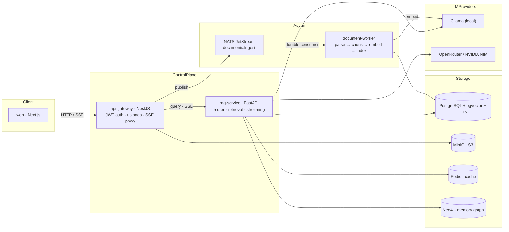

# Smoke Monkey — Architecture

Chat LLM with super memory and dynamic visual widgets, built on a PDF RAG core:
upload PDFs, ask questions, get answers with citations.

## System overview



**Supporting infra:** MinIO (S3) for original PDFs · Redis for query-answer
cache + rate limiting · Neo4j for the relationship-memory graph · LLM providers:
Ollama (local), OpenRouter and NVIDIA NIM (cloud). Embedding/chat/rerank layers
are independently configurable.

## Detailed topology

```
┌──────────────────────────────┐
│  web  (Next.js, SSR+stream)  │
└──────────────┬───────────────┘
               │ HTTP / SSE
               ▼
┌──────────────────────────────┐        ┌─────────────────────────────┐
│  api-gateway  (NestJS)       │        │  rag-service  (FastAPI)     │
│  • JWT auth / rate limit     │        │  • HyDE + multi-query       │
│  • validation / caching      │        │  • hybrid retrieval         │
│  • PDF upload → MinIO        │        │  • RRF fusion + rerank      │
│  • chat SSE proxy + persist  │        │  • context optimization     │
└──────┬───────────────┬───────┘        │  • streaming generation     │
       │               │                └──────────────┬──────────────┘
       │ publish       │ HTTP /api/v1/query (SSE)      │
       ▼               ▼                                ▼
┌──────────────────┐         ┌─────────────────────────────────────┐
│ NATS JetStream   │         │ PostgreSQL + pgvector + FTS          │
│ documents.ingest │         │  chunks: embedding vector(dims),    │
│ documents.ingested│        │  content_tsv (GIN), HNSW/GIN indexes│
└──────────────────┘         └─────────────────────────────────────┘
       │                                ▲
       ▼                                │
┌──────────────────────────────────────────────────────────────────┐
│  document-worker  (async ingestion)                               │
│  PDF → PyMuPDF text/tables (+ optional OCR) → parent-child chunks │
│  → embed provider (Ollama / OpenRouter / NVIDIA) → pgvector upsert│
└──────────────────────────────────────────────────────────────────┘
```

**Supporting infra:** MinIO (S3) for original PDFs · Redis for query-answer
cache + rate limiting · LLM providers: Ollama (local), OpenRouter and NVIDIA
NIM (cloud). Embedding/chat/rerank layers are independently configurable.

## Data flow

### 1. Ingestion (async)
1. `web` uploads a PDF → `api-gateway` validates (PDF, ≤10MB), stores it in
   MinIO under `users/{userId}/{docId}.pdf`, inserts a `documents` row, and
   publishes `documents.ingest` on NATS JetStream.
2. `document-worker` (durable pull consumer) downloads the file:
   - **Parse** — PyMuPDF extracts text per page; tables become markdown blocks;
     image-only pages can fall back to Tesseract OCR (`OCR_ENABLED`).
   - **Chunk** — heading-aware parent-child splitting. Parents are full pages
     (context expansion at query time), children are recursive splits with
     ~10% overlap that carry `page_number` for citations.
   - **Embed** — children are embedded in batches via the configured embed
      provider (Ollama `nomic-embed-text`, OpenRouter, or NVIDIA NIM).
   - **Index** — upsert into `chunks` (`parent` rows unembedded, `child` rows
      embedded), maintain `content_tsv` for keyword search, HNSW vector index
      (skipped for >2000-dim models, where pgvector has no index support).
   - Publish `documents.ingested` and flip `documents.status` to `ready`.

### 2. Query (real-time, SSE)
1. `web` POSTs the message → `api-gateway` JWT-validates, resolves/creates the
   conversation, persists the user message, and streams a proxy to
   `rag-service /api/v1/query`.
2. **Query understanding** — optional multi-query expansion (3 reformulations)
   and HyDE (a hypothetical answer is embedded alongside the query).
3. **Caching** — Redis query-answer cache keyed by
   `sha256(userId|message)` short-circuits identical questions.
4. **Hybrid retrieval**:
   - *Dense* — pgvector cosine (`embedding <=> query`, HNSW).
   - *Sparse* — Postgres FTS (`content_tsv @@ plainto_tsquery`).
   - **RRF fusion** merges both ranked lists; **cross-encoder reranking** via
      OpenRouter (`nvidia/llama-nemotron-rerank-vl-1b-v2:free`) is on by
      default and disabled via `OPENROUTER_RERANK_ENABLED=false`.
5. **Context optimization** — retrieved children are expanded with their parent
   page, re-ordered by document position to avoid lost-in-the-middle, and
   truncated to a token budget.
6. **Generation** — the configured chat LLM (Ollama, OpenRouter, NVIDIA NIM,
   or Gemini) streams the answer (SSE `chunk` events) under a system prompt
   that demands inline `[n]` citations.
7. **Post-processing** — citations + confidence are attached to the `done`
   event; `api-gateway` persists the assistant message and re-emits the final
   event with `messageId`.

## Database (PostgreSQL + pgvector)

| Table | Owned by | Purpose |
|-------|----------|---------|
| `users` | api-gateway | accounts, bcrypt password hashes |
| `documents` | api-gateway | metadata + status (`uploading → processing → ready/failed`) |
| `conversations` | api-gateway | chat threads |
| `messages` | api-gateway | chat turns + citations JSONB + confidence |
| `chunks` | document-worker | parent/child chunks, `embedding vector(dims)` (768 for nomic, 2048 for Nemotron-3 Embed), `content_tsv`, HNSW/GIN indexes |
| `feedback` | rag-service | per-message helpfulness |

## Messaging (NATS JetStream)

- Stream `DOCUMENTS`, subjects `documents.>`.
- `documents.ingest` — job payload `{jobId, documentId, userId, filename, s3Key}`.
- `documents.ingested` — outcome `{documentId, status, chunkCount, error?}`.
- Durable consumer `document-worker` guarantees at-least-once delivery
  (ACK after index, NAK + retry up to 5 deliveries, `ack_wait` 180s).

## Streaming contract

Every SSE event is `event: <type>` + `data: <json>`:

| event | payload |
|-------|---------|
| `meta` | `{conversationId}` |
| `sources` | `{citations: Citation[]}` |
| `chunk` | `{text}` (token delta) |
| `done` | `{messageId, citations, confidence, cached}` |
| `error` | `{message}` |

## Security & reliability

- JWT (Bearer) auth on every API route; bcrypt password hashing.
- Global NestJS throttling (120 req/min) + class-validator whitelisting.
- MinIO credentials / JWT secret externalized via env; never hardcoded in code.
- NATS JetStream file persistence for durability; HNSW requires no training
  (warm-start friendly); TypeORM `synchronize` in dev only (migrate for prod).
