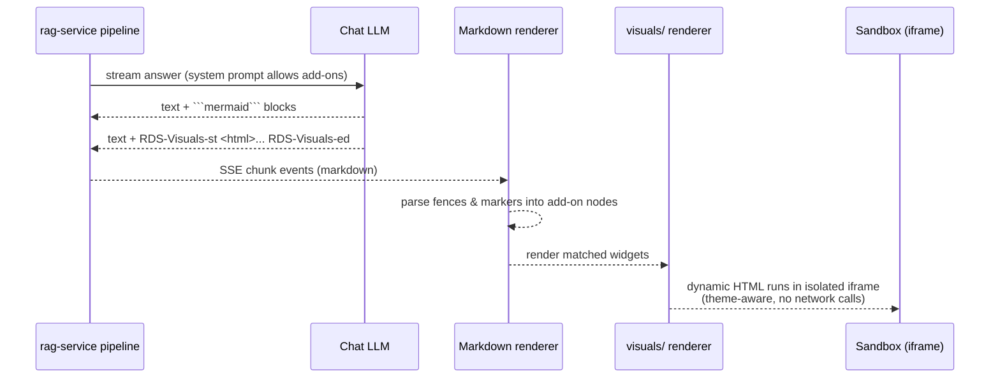

# Dynamic Visual Widgets

Smoke Monkey answers aren't just text. When a picture genuinely makes the
answer clearer, the LLM appends **live widgets** to the markdown stream and the
frontend renders them instantly, sandboxed, beside the prose.

The system is driven by a single prompt rule (see
`apps/rag-service/src/generation/prompts.py`): *"Use the exact marker pattern —
close every marker block with its matching end marker."* Three widget types are
supported, rendered by `apps/web/components/visuals/`.


## Widget types

| Type | Marker / fence | Rendered by | Example use |
|---|---|---|---|
| **Mermaid diagram** | ```` ```mermaid ```` | `MermaidDiagram.tsx` | flowcharts, sequence, state |
| **Canvas spec** | ```` ```canvas ```` (JSON body) | `StreamingVisual.tsx` | animated particle flow diagrams |
| **Dynamic HTML** | `RDS-Visuals-st` … `RDS-Visuals-ed` | `IsolatedHtml.tsx` + `AddonShell.tsx` | games, charts, simulators, UI mockups |
| **Multi-file project** | `File-Based-st` … `File-Based-ed` | `FileBasedViewer.tsx` | full app/website code previews |

## How it flows



## Dynamic HTML widget contract

The LLM is instructed to emit **one complete, self-contained HTML document**
between the markers (no code fence):

```
RDS-Visuals-st
<!DOCTYPE html>
<html lang="en">
<head>
  <meta charset="utf-8">
  <meta name="viewport" content="width=device-width, initial-scale=1">
  <style>
    body { margin: 0; background: #0B1120; color: #F8FAFC; font-family: system-ui; padding: 24px; }
  </style>
  <script id="visual-metadata" type="application/json">
  {
    "id": "demo_viz_00001",
    "title": "Pricing card",
    "description": "A clickable pricing card demo",
    "category": "ui",
    "safe_to_share": true,
    "tags": ["pricing", "card"],
    "search_keys": ["pricing card demo"],
    "created_at": "2026-01-01",
    "version": "1.0"
  }
  </script>
</head>
<body>
  <h2>Pricing card</h2>
  <button class="btn" onclick="alert('Clicked!')">Get started</button>
</body>
</html>
RDS-Visuals-ed
```

Design constraints the model follows (and the renderer enforces):

- **Self-contained** — inline `<style>`/`<script>`, no external assets.
- **No network calls** — the preview is sandboxed and offline.
- **Accent palette** — `#7C3AED` purple, `#06B6D4` cyan, `#22C55E` green on a
  `#0B1120` background.
- **Metadata** — the `<script id="visual-metadata">` JSON block (id, title,
  description, category, tags) is used for the widget header and search.
- **Games** — add mobile touch controls, a click-to-start overlay, a score and
  restart logic.
- **Keep scripts small** — under ~60 lines, focused on one idea.

## Canvas spec

A ```` ```canvas ```` fence whose body is valid JSON is rendered as an animated
flow diagram (particles flow along the edges):

```json
{
  "title": "Hybrid Retrieval Flow",
  "nodes": [
    { "id": "q",    "label": "User Query",          "kind": "input"   },
    { "id": "kw",   "label": "Keyword Extraction",  "kind": "process" },
    { "id": "sem",  "label": "Semantic Embedding",  "kind": "process" },
    { "id": "fuse", "label": "Score Fusion",        "kind": "merge"   },
    { "id": "out",  "label": "Final Ranked Results","kind": "output"  }
  ],
  "edges": [
    { "from": "q", "to": "kw" },
    { "from": "q", "to": "sem" },
    { "from": "kw", "to": "fuse" },
    { "from": "sem", "to": "fuse" },
    { "from": "fuse", "to": "out" }
  ]
}
```

- `kind` controls node colour: `input` cyan · `process` purple · `merge` amber ·
  `output` green.
- Every `from`/`to` must reference an existing node `id`.
- The fence body must be valid JSON — no trailing commas, no surrounding text.
- A `canvas` block whose body is **not** JSON is treated as interactive HTML +
  JS and rendered in a sandboxed live preview.

## Safety

- Dynamic HTML runs inside an **isolated, sandboxed preview** with no network
  access (see `IsolatedHtml.tsx` and `useTailwindCdn.ts`).
- A single malformed or unclosed marker block degrades gracefully — the widget
  simply doesn't render; the text answer is unaffected.
- `safe_to_share` in the metadata controls whether a widget may be reused or
  shared across conversations.

**Related:** [architecture](architecture.md) · [super memory](super-memory.md) ·
[retrieval flow](retrieval-flow.md)
