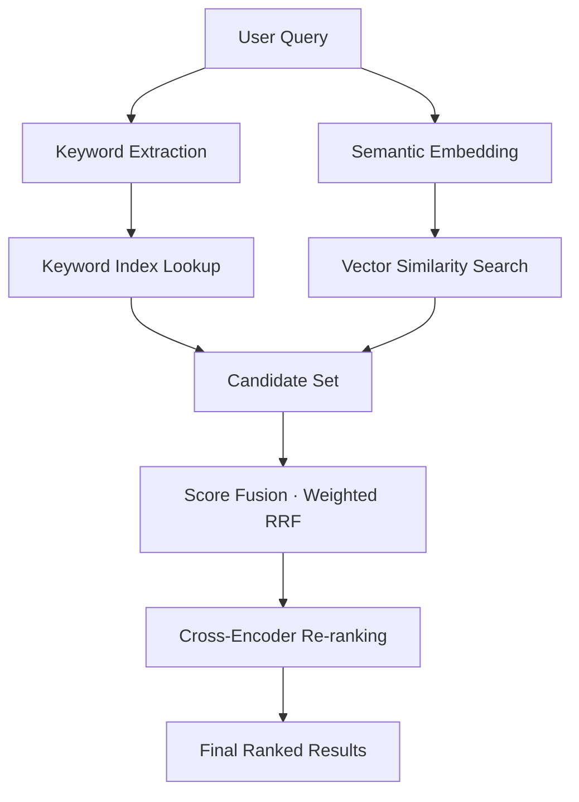

# Hybrid Retrieval Flow

How a query travels through the retrieval pipeline, from the raw user message
to the ranked chunks that feed the answer. Paste this file's content into a
chat message to see both add-on widgets render on the frontend.

## The pipeline at a glance

1. **User Query** — the raw question is normalized and understood.
2. **Keyword Extraction** — tokens are pulled out for sparse (lexical) search.
3. **Semantic Embedding** — the query is embedded for dense (vector) search.
4. **Candidate Set** — both retrievers return their top candidates.
5. **Score Fusion** — the two ranked lists are merged with weighted RRF.
6. **Re-ranking** — a cross-encoder re-scores the merged candidates.
7. **Final Ranked Results** — the top chunks (with scores) feed generation.



> The block above is the ` ```mermaid ` **add-on** — the frontend extracts it
> from the markdown stream and renders it as a live, theme-aware diagram.

## Animated canvas visualization

The same flow, expressed as a ` ```canvas ` add-on. The frontend extracts the
JSON spec and renders it on an HTML `<canvas>` with animated particles flowing
along the edges (Tailwind classes style the surrounding frame):

```canvas
{"title":"Hybrid Retrieval Flow","nodes":[{"id":"q","label":"User Query","kind":"input"},{"id":"kw","label":"Keyword Extraction","kind":"process"},{"id":"sem","label":"Semantic Embedding","kind":"process"},{"id":"fuse","label":"Score Fusion","kind":"merge"},{"id":"rank","label":"Re-ranking","kind":"process"},{"id":"out","label":"Final Ranked Results","kind":"output"}],"edges":[{"from":"q","to":"kw"},{"from":"q","to":"sem"},{"from":"kw","to":"fuse"},{"from":"sem","to":"fuse"},{"from":"fuse","to":"rank"},{"from":"rank","to":"out"}]}
```

## Why two retrievers

| Approach | Search type | Strengths | Weaknesses |
|----------|-------------|-----------|------------|
| Keyword (sparse) | Postgres FTS `content_tsv` | Exact terms, IDs, rare tokens, fast | Misses synonyms / paraphrases |
| Semantic (dense) | pgvector cosine (`<=>` HNSW) | Meaning, synonyms, rephrasing | Can miss exact/rare terms |

Fusing both with RRF means neither retriever's blind spot matters alone — the
merge keeps whatever each one ranked best.

## Canvas spec reference

```json
{
  "title": "Optional heading shown on the widget",
  "nodes": [
    { "id": "unique-id", "label": "Display label", "kind": "input | process | merge | output" }
  ],
  "edges": [
    { "from": "unique-id", "to": "unique-id" }
  ]
}
```

- `kind` controls the node color: `input` cyan, `process` purple, `merge` amber,
  `output` green.
- Every `from`/`to` must reference an existing node `id`.
- The fence body must be valid JSON — no trailing commas, no surrounding text.

## Full HTML + JS canvas

A ` ```canvas ` block whose body is **not** JSON is treated as an interactive
HTML + JavaScript snippet and rendered in a sandboxed live preview (the script
actually runs). Use it for anything custom or animated — charts, recursion
trees, search-in-action demos:

```canvas
<canvas id="sort" width="480" height="180"></canvas>
<script>
  const c = document.getElementById('sort');
  const x = c.getContext('2d');
  const n = 24;
  const vals = Array.from({ length: n }, () => Math.random() * 140 + 10);
  const barW = 480 / n;
  let i = 0, j = 0, running = true;

  function step() {
    if (i < n - 1) {
      if (j < n - i - 1) {
        if (vals[j] > vals[j + 1]) {
          [vals[j], vals[j + 1]] = [vals[j + 1], vals[j]];
        }
        j++;
      } else { j = 0; i++; }
    } else { running = false; }
  }

  function draw() {
    x.clearRect(0, 0, 480, 180);
    for (let k = 0; k < n; k++) {
      x.fillStyle = running && k === j ? '#06B6D4' : '#7C3AED';
      x.fillRect(k * barW + 1, 180 - vals[k], barW - 2, vals[k]);
    }
    if (running) { step(); requestAnimationFrame(draw); }
  }
  draw();
</script>
```

When the LLM explains a process during a conversation, it can drop in these
canvas widgets on the fly — the UI renders them live alongside the text.
