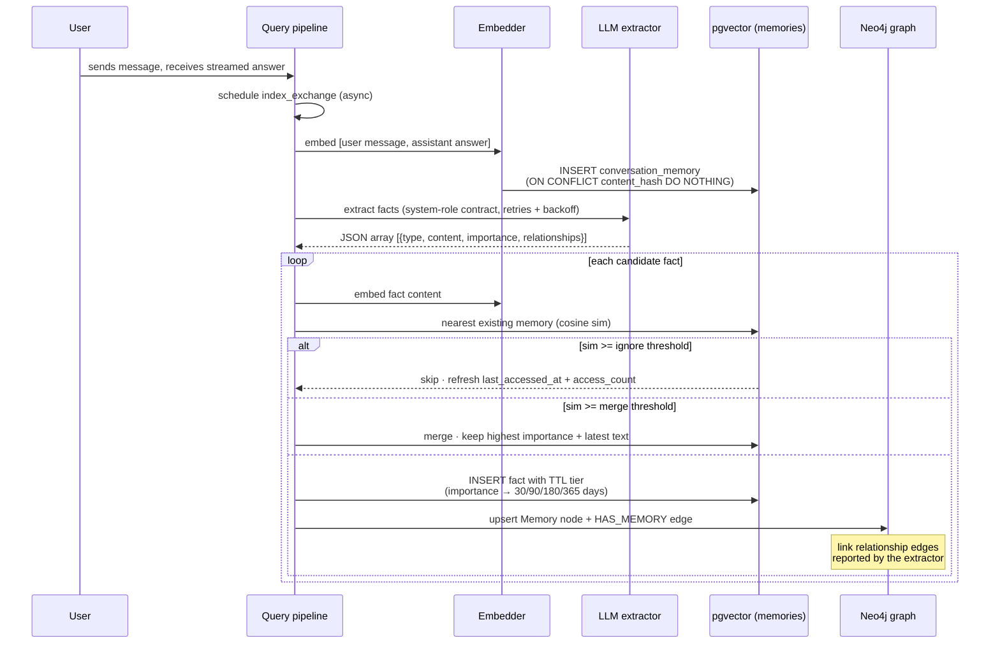
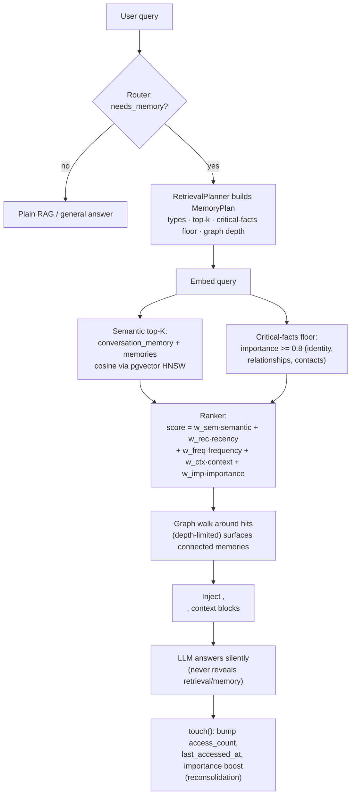
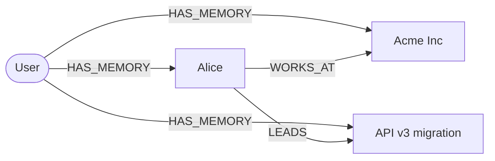

# Super Memory

> The assistant remembers every conversation across sessions, builds a durable
> user profile, and never announces that it consulted a memory store.

Super memory lives in the **rag-service** (`apps/rag-service/src/application/memory.py`
and the `application/mem/` graph layer). It is built from four mechanisms:

1. **Episodic memory** — every user/assistant message is embedded and stored
   per user in `conversation_memory` (pgvector), so "what did we decide about
   OpenSearch?" is answered from *this* user's own history.
2. **Durable user facts** — an LLM extracts preferences, projects, procedures
   and facts from each exchange into `memories`, with an **importance** score
   and a priority-based **TTL tier**.
3. **Relationship graph** — a Neo4j layer links memories with typed edges
   (`WORKS_AT`, `REPORTS_TO`, `PREFERS`, …) so retrieval can walk connected
   memories the query never mentioned.
4. **Human-like memory mechanics** — a forgetting curve, recency/frequency
   re-ranking, reconsolidation on recall, and a consolidation pass that purges,
   decays and merges.

## Write path (fire-and-forget)

After a streamed answer completes, the pipeline schedules `index_exchange`.
It must never block or break the response — all failures are logged at debug.



### Fact extraction

The extractor is called with a **system-role format contract** (models follow
system messages far more reliably than one-shot walls of text), a generous
token budget, and two fallback attempts with escalating backoff (2s → 6s → 12s)
because cloud endpoints throw spurious 4xx/5xx under load. Output is a strict
JSON array; prose-narrating models are handled by a tolerant parser that scans
for the outermost `[...]` span.

Accepted fact types: `preference`, `project`, `procedure`, `fact`. Facts below
`memory_extract_min_importance` are dropped; importance is clamped to [0, 1].

## Read path (query time)



### The ranker

Semantic filtering happens first (pgvector), then a **blended ranker** orders
the candidates:

```
score = w_sem · semantic
      + w_rec · 2^(-age_hours / half_life)     ← recency, measured from last recall
      + w_freq · log10(access_count + 1)       ← frequency, saturates at 10+ uses
      + w_ctx  · query-token overlap           ← lexical context overlap
      + w_imp  · importance                    ← durable facts rank above trivia
```

Recency is anchored on **last access, not creation** — a memory touched
recently feels fresh no matter how old it is (human reconsolidation).

## Memory mechanics (human-like)

| Mechanism | Implementation |
|---|---|
| **Forgetting curve** | Below-critical facts lose `memory_decay_daily` importance per day since last recall, after a `memory_decay_grace_days` grace period. |
| **Forget floor** | Facts whose importance fades below `memory_forget_floor` are deleted. |
| **Reconsolidation** | Every recall bumps `access_count`/`last_accessed_at` and adds `memory_reconsolidation_boost` to fact importance (capped at 1.0). |
| **Merge** | Near-duplicate facts (`sim >= memory_dedupe_merge`) collapse into one canonical memory; the strongest variant (higher importance / longer text) survives. |
| **TTL tiers** | importance ≥ 0.8 → 365d · ≥ 0.6 → 180d · ≥ 0.4 → 90d · else 30d. |
| **Critical-facts floor** | Facts with importance ≥ 0.8 are always recall candidates regardless of the query, so identity/relationship facts are never starved out. |
| **Episodic retention** | Raw conversation turns are purged after `memory_episodic_retention_days`. |

The consolidation pass runs at service startup (`MemoryStore.consolidate`).

## Relationship graph



Typed edges (`_REL_TYPES`) are created by the memory agent from the
relationships the extractor reports, and are **sanitized against a fixed
allow-list** before interpolation into Cypher (relationship types cannot be
parameterized in Neo4j). Retrieval walks the graph around semantic hits to
surface connected memories the query never mentioned. A down or absent graph
degrades to a no-op — memory stays best-effort.

## Configuration

| Variable | Default | Purpose |
|---|---|---|
| `MEMORY_ENABLED` | `true` | master switch |
| `MEMORY_TOP_K` | `5` | memory hits injected into the answer prompt |
| `MEMORY_EXTRACT_ENABLED` | `true` | durable fact extraction |
| `MEMORY_EXTRACT_MIN_IMPORTANCE` | `0.5` | drop trivia below this |
| `MEMORY_GRAPH_ENABLED` | `false` | Neo4j relationship layer |
| `MEMORY_CONSOLIDATE_ENABLED` | `true` | startup consolidation pass |
| `MEMORY_WEIGHT_SEMANTIC` / `_RECENCY` / `_FREQUENCY` / `_CONTEXT` / `_IMPORTANCE` | `0.4` / `0.2` / `0.1` / `0.2` / `0.1` | ranker blend weights |
| `MEMORY_RECENCY_HALF_LIFE_HOURS` | `720` | recency half-life (30 days) |
| `MEMORY_DEDUPE_IGNORE` / `_MERGE` | `0.97` / `0.93` | write-path dedupe thresholds |
| `MEMORY_DECAY_DAILY` | `0.01` | daily importance erosion |
| `MEMORY_FORGET_FLOOR` | `0.25` | below this → forgotten |

**Related:** [architecture](architecture.md) · [retrieval flow](retrieval-flow.md) ·
[dynamic visual widgets](dynamic-visual.md)
